# How to Debug 101

## Debugging with Print Statements

We've all been there - trying to track down a bug in our code and resorting to adding print statements everywhere to see what's going on.

The simplicity of printing variable values or messages to check program flow makes print debugging an easy first step when issues arise. Just add a few print statements, run the code, and check the output to gain insight into what's happening under the hood. It doesn't require any fancy tools or setup.

However, print debugging has its downsides. It can clutter up the code with lots of print statements that you'll later have to clean up. And it doesn't work well for tracing deeper logical issues. Excessive printing can also slow down the program. After all the course is about being computationally efficient.

Here is some of my code from Freshman year. 😳
(not a good practice)

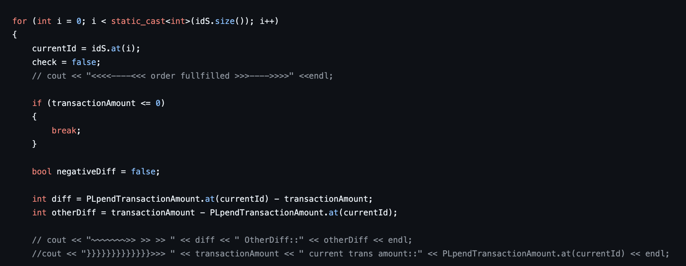

## Debugging with a Debugger

While print statements have their place, to take your debugging skills to the next level, it's worth learning how to use a debugger built into your IDE. Debuggers allow you to pause execution, inspect variables, and step through your code line-by-line to understand what's happening.

Many IDEs like Visual Studio, and PyCharm have excellent debugging support. It's just a matter of learning the basics:

* Setting breakpoints to pause execution at certain lines
* Inspecting variables to check their values
* Stepping over, into, or out of functions as you walk through code
* Viewing the call stack to understand the execution path

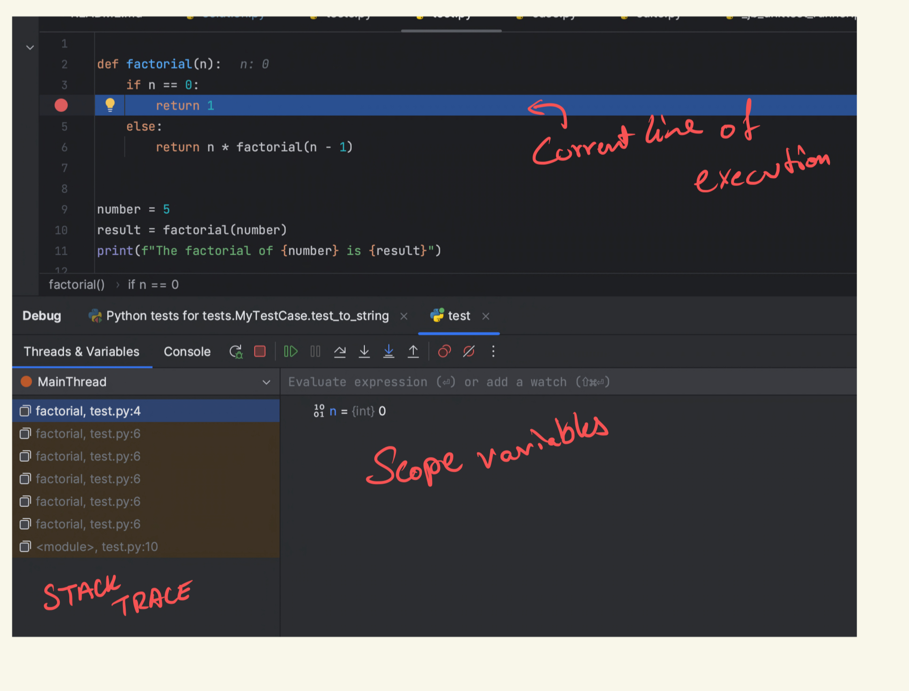

It may feel daunting at first if you've never used a debugger. But once you get the hang of it, you'll have way more visibility into your code and can zero in on problems much faster than with print statements alone. 

### Working with breakpoints

Breakpoints are one of the most useful features of debuggers in IDEs like VSCode and PyCharm. They allow you to pause execution at any line of code you specify to inspect the state of the program.

In VSCode, you can set a breakpoint by clicking on the editor margin to the left of the line number you want to break on. A red dot will appear indicating the breakpoint.

<!-- 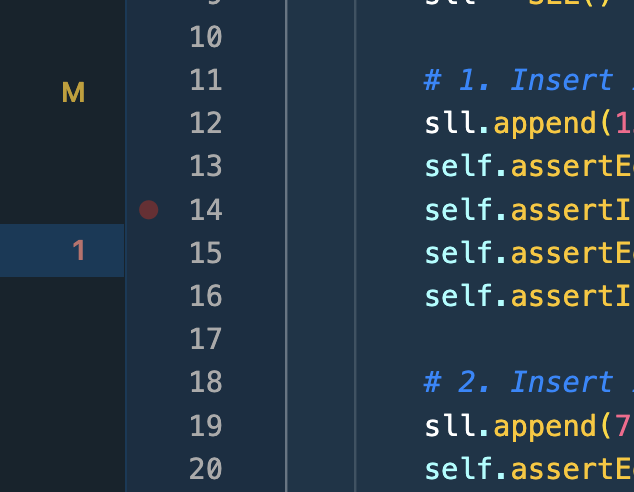 -->

In PyCharm, click on the line number to set a breakpoint. Similar to VSCode, a red dot will appear indicating the breakpoint.

<!-- 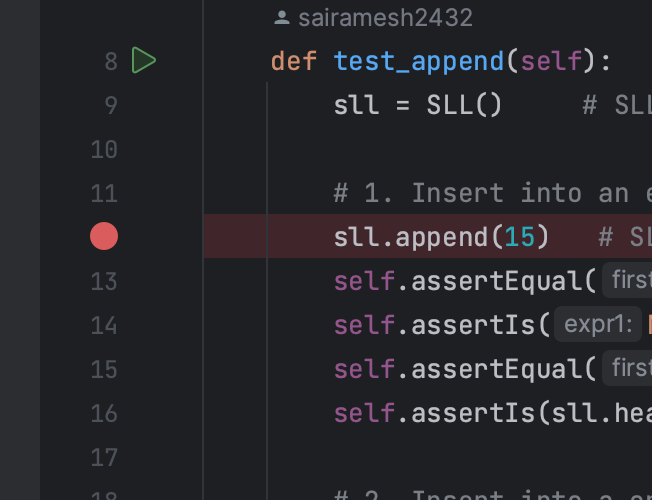 -->

Breakpoints are enabled only during debug mode.

Here is an example of where a breakpoint has been hit during debugging for project 1.

The blue line highlights the current line of execution. 
<!-- 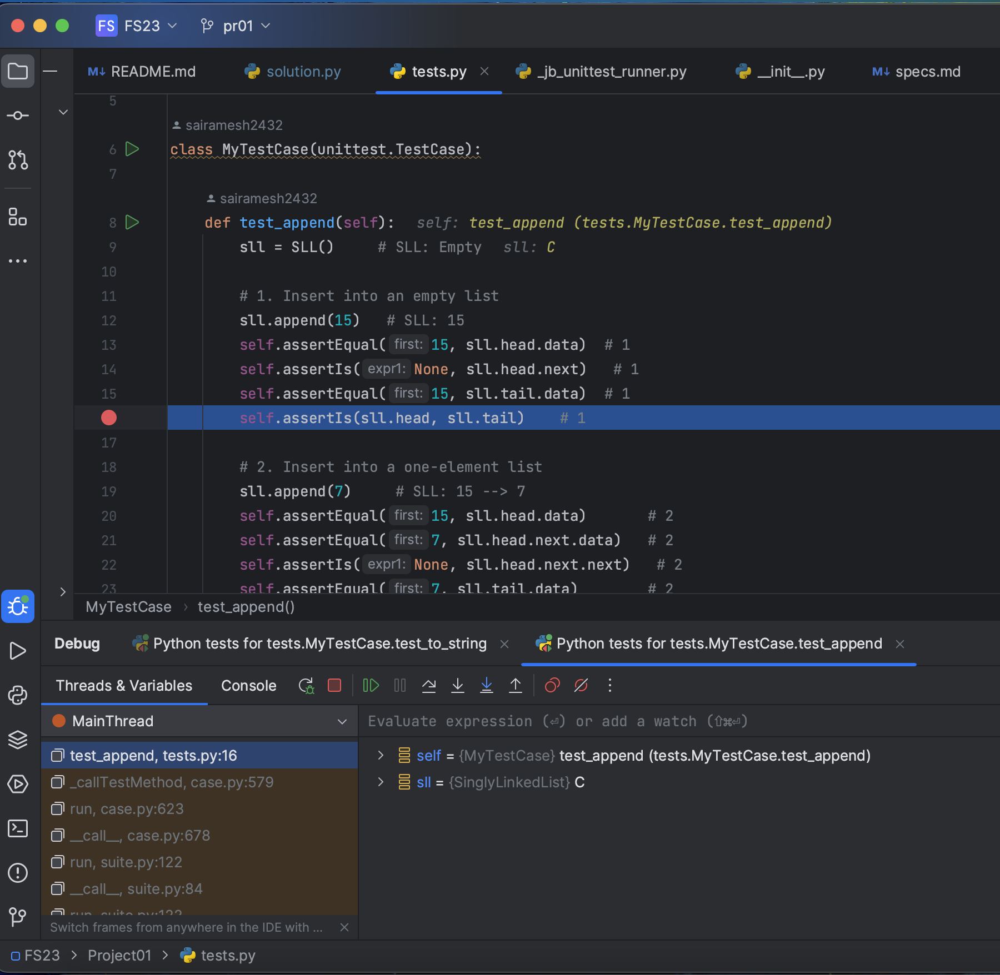 -->

In the lower right, we can inspect the variables in the current scope at the breakpoint. For advanced classes and Data Structures the can be peeked in.

Key tips for inspecting variables:

* Check if a variable has the expected value at a given point.
* Inspect object properties to ensure they are set properly.
* Watch a variable to see when its value deviates from expectations.

### Hover Inspection
Both VSCode and PyCharm provide a handy hover inspection feature that lets you view variable values during debugging without explicitly expanding variables or setting watches.

Simply hover over any variable when paused on a breakpoint to see a popup with the current value.

<!-- 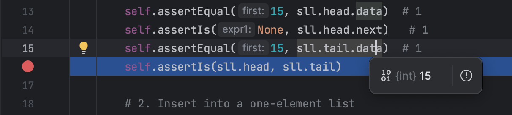 -->

### Navigating Debugged Code
Once execution is paused on a breakpoint, you have several options to step through code and analyze the flow:

<!-- 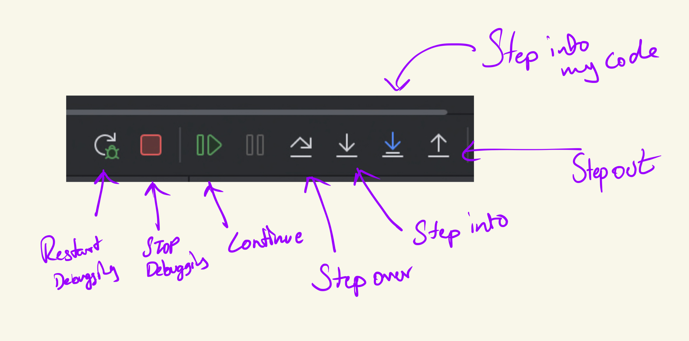 -->

* Resume - Resumes full execution until the next breakpoint. Useful to fast forward past uninteresting sections.
* Step Over - Steps to the next line, but does not enter any functions called on that line. Steps over code without digging into it.
* Step Into - Steps to the next line, entering any functions called on that line. Steps into code to deeply analyze it.
* Step Out - Runs the rest of the current function and stops at the line after the function call. Great for stepping out of code you don't need to debug.

### Leveraging the Stack Trace
Another useful debugging tool provided by IDEs' like VSCode and PyCharm is the stack trace. This gives you visibility into the sequence of function calls that led to the current execution point. Very Very useful for functional programming and recursion.

<!-- 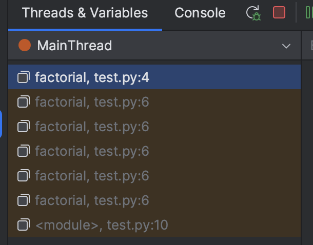 -->

When paused in the debugger, the stack trace shows the chain of functions calls in order from the top-level caller down to the current line of execution. This helps reconstruct how the code reached its current state. functions in the stack can also be selected and paired with peeking you can see when happened before the code jump.

### Oops my test cases failed during debugging (user uncaught exceptions).
This was my personal favorite trick to debug with.

Sometimes your code will fail as we have set asserts in our test cases to enurse that projects are properly coded to base and edge cases. It might be hard to point what went wrong during the execution. Enabling "user uncaught exceptions" in debug mode will save the day! When turned on, your code will pause execution right before an unhandled exception occurs, rather than crashing. This allows you to inspect the program state and variables leading up to the exception, making it much easier to identify the source of the problem.

Here is how you can enable it in VSCode and PyCharm:

For vscode it is a enabled by checking the box in the debug tab called `user uncaught exception`.
<!-- 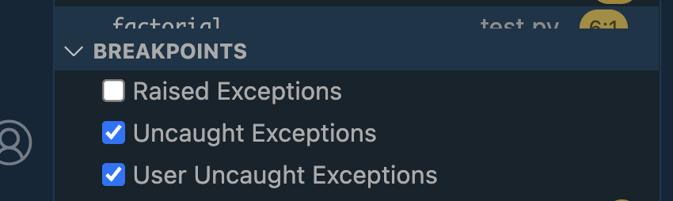 -->

For PyCharm use `shift + ctrl/⌘ + F8` and set the permission to the following settings.
<!-- 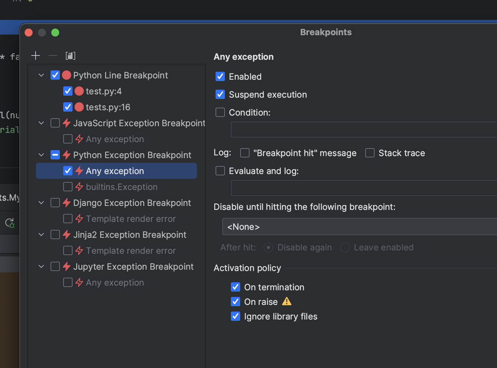 -->

Here is an example of an error with peeking of other variables
<!-- 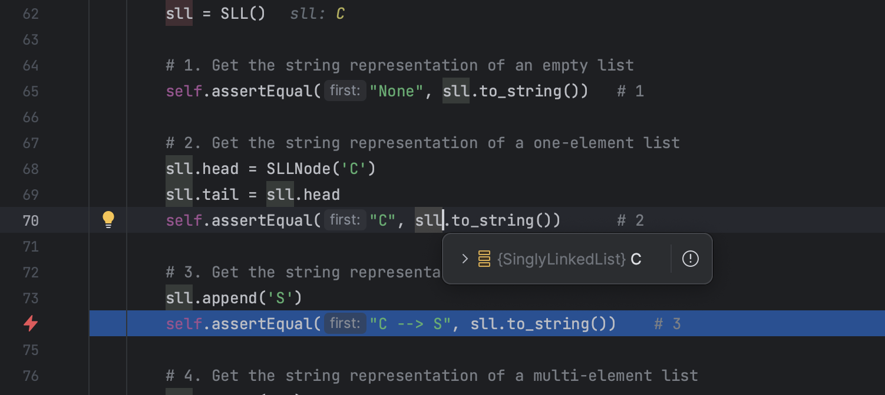 -->

### Using Conditional Breakpoints

Regular breakpoints pause execution every time a line is hit. For more control, you can use conditional breakpoints to only break when certain criteria are met. Conditional breakpoints include an expression that is evaluated each time the line is reached. The debugger only pauses if the expression evaluates to true.

<!-- 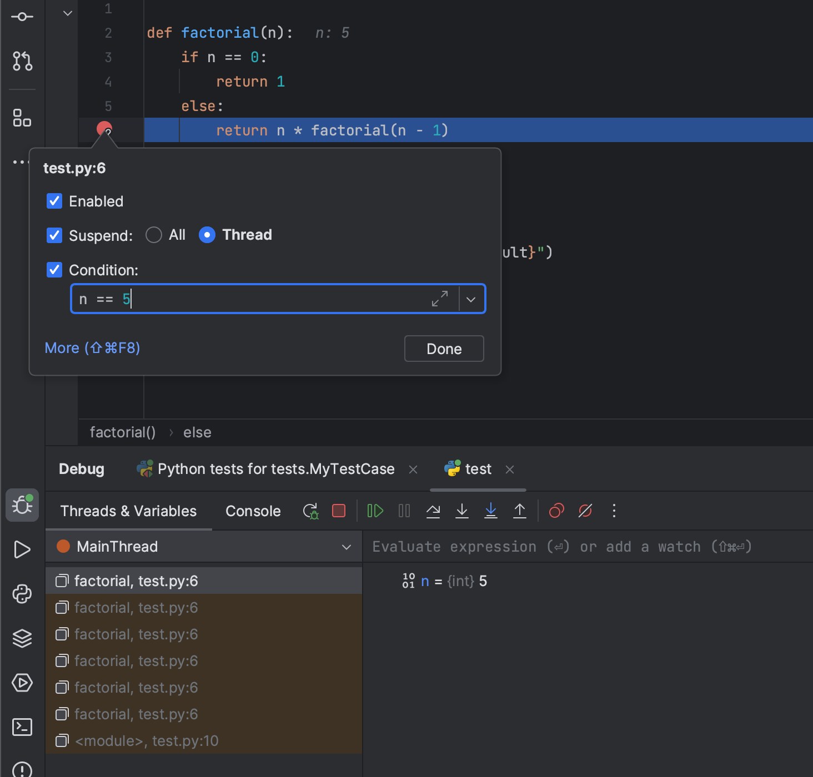 -->

---
Debugging is a crucial programming skill that takes time and a lot of patience to master. But with practice, you'll be able to track down bugs faster and write more robust code. The investment of time pays off greatly in the long run.

Happy ~~Coding!~~ Debugging!

Aman Dhruva Thamminana & CSE 331 Team

---

in the meanwhile enjoy these :

